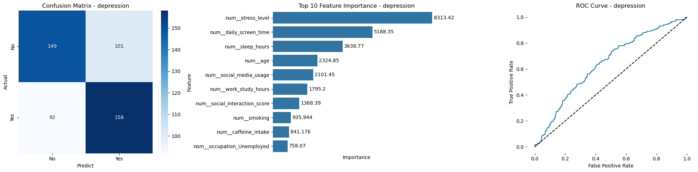
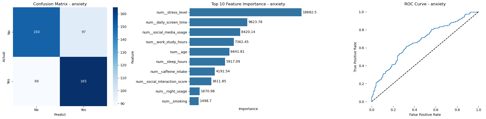
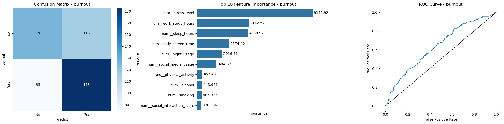

# Mental Health & Behavioral Risk Analysis

## Project Overview
* **Objective:** I built this machine learning pipeline to predict the risk of Depression, Anxiety, and Burnout based on daily lifestyle habits, helping healthcare professionals and individuals identify early warning signs and proactively manage their mental well-being.
* **Data Processing & EDA:** I cleaned the dataset, analyzed the highly balanced target classes, and explored key behavioral distributions before applying transformations like Yeo-Johnson and Standardization.
* **Model Building & Feature Engineering:** I constructed a robust preprocessing pipeline using `ColumnTransformer` and trained an optimized `LightGBM` model using `Optuna` for automated hyperparameter tuning.
* **Model Performance:** I evaluated the models using F1-score and accuracy, where the Burnout prediction model performed best, achieving an F1-Score of 0.60 and demonstrating strong predictive capability in identifying high-risk individuals.

## Objective
The primary goal of this project is to create tangible value by uncovering the hidden relationships between daily habits—such as screen time, sleep, and work hours—and severe mental health conditions. By providing a predictive tool, I aim to empower individuals to make data-driven lifestyle adjustments and assist medical practitioners in screening patients for Depression, Anxiety, and Burnout before symptoms escalate. This proactive approach can significantly reduce the burden on healthcare systems and improve overall quality of life.

## Resources Used
* **Languages:** Python
* **Libraries & Packages:** `pandas`, `numpy`, `scikit-learn`, `lightgbm`, `optuna`, `matplotlib`, `seaborn`
* **Tools:** Jupyter Notebook, Scikit-learn Pipeline
* **Data Source:** [Kaggle - Mental Health and Behavioral Risk Dataset](https://www.kaggle.com/datasets/abrerjawod/mental-health-and-behavioral-risk-dataset)

## Project Features Explanation
The dataset used in this project is the **Mental Health and Behavioral Risk Dataset (2,000 Samples)**, sourced from Kaggle. It includes the following key variables:
* **age:** The individual's age.
* **gender:** The individual's gender.
* **occupation:** The individual's primary occupation (e.g., Student, Corporate Worker).
* **daily_screen_time:** The average number of hours spent looking at screens daily.
* **social_media_usage:** The frequency or duration of social media engagement per day.
* **night_usage:** An indicator of screen usage or active behavior during late night hours.
* **sleep_hours:** The average number of hours the individual sleeps per night.
* **stress_level:** A self-reported metric indicating the individual's daily stress (the strongest predictor across all models).
* **work_study_hours:** The amount of time dedicated to work or academic studies daily.
* **physical_activity:** The individual's physical activity level (e.g., Low, Medium, High).
* **social_interaction_score:** A score reflecting the frequency and quality of daily social interactions.
* **caffeine_intake:** The level of daily caffeine consumption.
* **smoking:** Whether the individual smokes or not.
* **alcohol:** The individual's alcohol consumption habits.
* **depression:** One of the target variables; whether the individual is at risk of depression (Yes/No).
* **anxiety:** One of the target variables; whether the individual is at risk of anxiety (Yes/No).
* **burnout:** One of the target variables; whether the individual is at risk of burnout (Yes/No).

## Data Cleaning
To ensure the data was ready for modeling, I performed the following preprocessing steps:
* Separated features into continuous numerical columns and categorical columns.
* Handled ordinal categorical features (like 'physical_activity') by applying `OrdinalEncoder` followed by `StandardScaler`.
* Transformed skewed numerical features using `PowerTransformer` with the Yeo-Johnson method to make their distributions more normal distribution.
* Combined all preprocessing steps seamlessly using a `ColumnTransformer` to prevent data leakage during training.

## Exploratory Data Analysis (EDA)
During my exploratory analysis, I discovered several critical insights regarding lifestyle impacts:
* The classes for all three target variables (Depression, Anxiety, Burnout) were highly balanced, eliminating the need for complex sampling techniques like SMOTE.
* **Stress Level** showed a massive correlation with all three conditions, particularly Burnout and Anxiety.
* I found a strong direct link between a lack of **Sleep Hours** combined with high **Work/Study Hours** and the likelihood of experiencing Burnout.
* High **Daily Screen Time** and **Social Media Usage** were prominently associated with Anxiety cases.

## Model Building & Feature Engineering
For feature engineering, I encapsulated all transformations into a single `scikit-learn` Pipeline. I used `OrdinalEncoder` for ranked categories, `StandardScaler` to normalize scales, and `PowerTransformer` to correct skewness in numerical variables. 

For the modeling phase:
* **LightGBM Classifier:** I chose LightGBM due to its speed, efficiency, and excellent handling of complex tabular data. I specifically set `importance_type='gain'` to accurately measure the true predictive power (loss reduction) of each lifestyle feature rather than just the split frequency.
* **Optuna Optimization:** To maximize performance, I integrated Optuna to automatically search for the optimal hyperparameters (like `n_estimators`, `learning_rate`, `num_leaves`, and `max_depth`) using a 5-fold `StratifiedKFold` cross-validation strategy.

## Model Performance
I evaluated the optimized LightGBM models on the test set using F1-score, accuracy, and ROC curves. 
* The **Burnout model** achieved the highest overall performance with an **F1-Score of 0.60** and an accuracy of 60%, making it my most reliable model in this project.
* The models proved highly effective at identifying "Yes" cases (individuals at risk). For instance, the Anxiety model correctly identified 165 out of 253 at-risk individuals, while the Burnout model correctly caught 173 out of 258 cases.
* The ROC Curves for all three target variables remained solidly above the baseline, confirming that I successfully learned the underlying patterns distinguishing healthy states from mental health risks.

